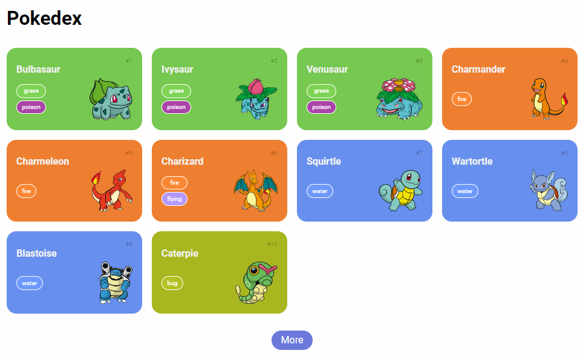

# Coffee Shop Webpage

### Introduction

---

In this project we developed a Pokedex, with a basic graphical interface and responsive, through the use of **REST API**. Some tools and technologies such as HTML, CSS JavaScript and PokeApi (https://pokeapi.co) used.

### Tools

---

* HTML
* CSS
* Javascript
* PokeApi (**REST API**)

### Result

---

