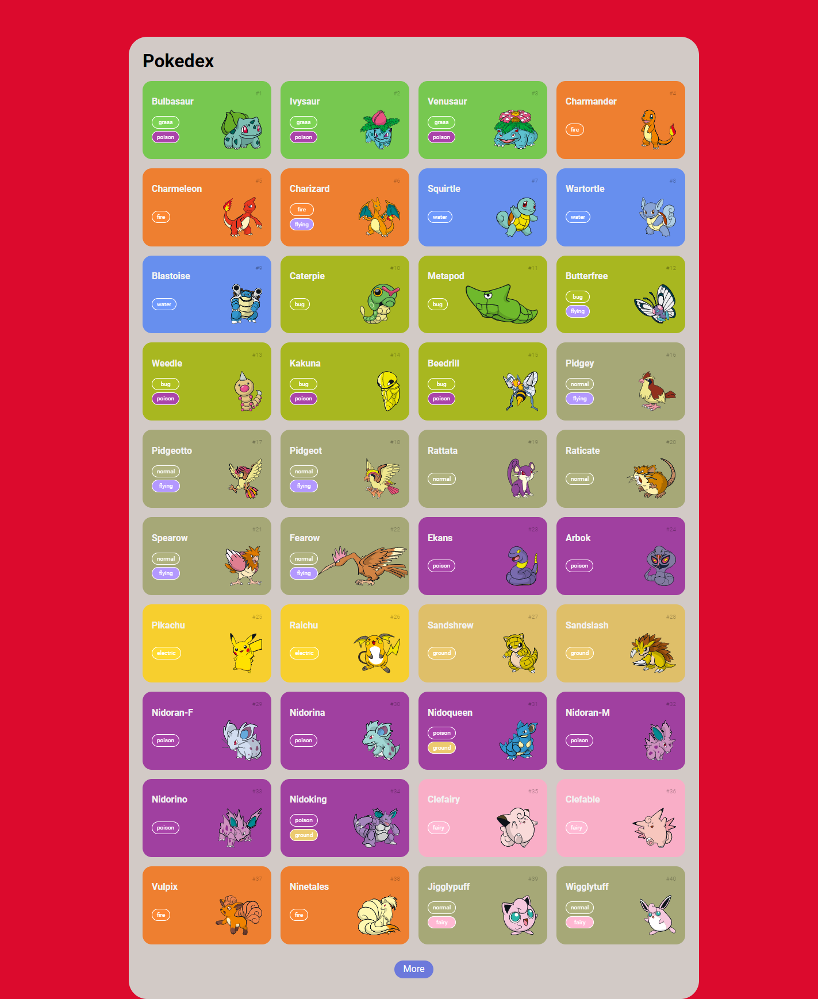

# Pokedex

This project is a web-based Pokedex application that allows users to browse information about different Pokemon species. It is built using HTML, CSS, JavaScript, and utilizes the PokeApi REST API to gather data.

## Description

The Pokedex project aims to provide a fun and easy-to-use resource for Pokemon enthusiasts to browse information about their favorite Pokemon. The application features a graphical interface that is both responsive and visually appealing.

## Features

- Graphical interface that is responsive and visually appealing
- Access to detailed information about different Pokemon species
- Integration with PokeApi REST API to gather data

## Technologies Used

- HTML
- CSS
- JavaScript
- PokeApi (REST API)

## Usage

To use the Pokedex application, simply visit the website URL or clone this repository and open the `index.html` file in your preferred web browser. The website will load automatically, and you can start searching for different Pokemon by name or ID.

## Contributing

Contributions to this project are welcome! Feel free to fork this repository and submit a pull request with your changes.

## Credits

This project was built by [Francisco Silva](https://github.com/Burntroll).

## License

This project is licensed under the [MIT License](https://opensource.org/licenses/MIT).

## Results

